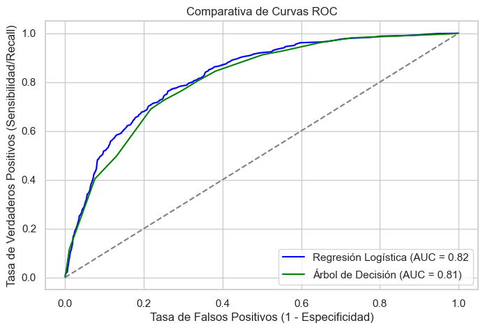
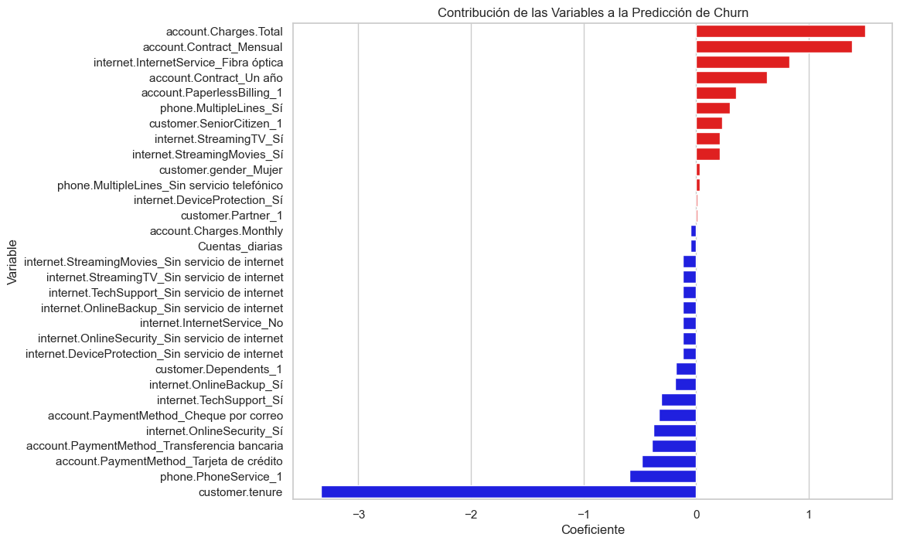
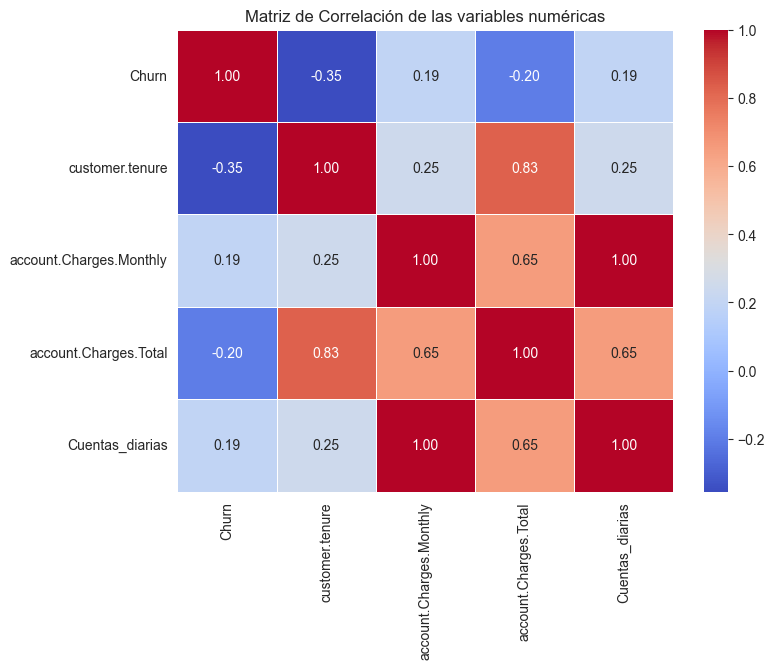
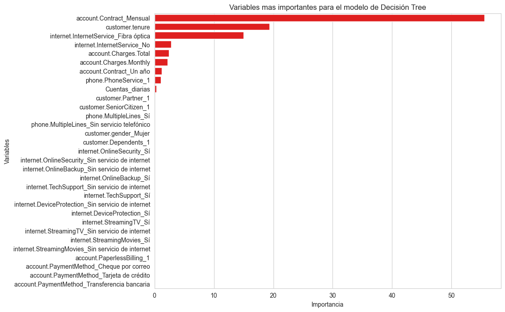

# Informe de Predicción de Cancelación de Clientes (Churn) - TelecomX LATAM - Parte 2
**Nombre** Luis Gerardo Hernández Román

**Fecha:** 25 de febrero de 2026  
**Proyecto:** Modelo de Clasificación para Retención de Clientes

---

## 1. Introducción
El objetivo de este proyecto es identificar a los clientes con mayor probabilidad de cancelar su servicio y entender los factores clave que impulsan esta decisión. Se compararon dos modelos: **Regresión Logística** y **Árbol de Decisión**.

## 2. Metodología
* **Preprocesamiento:** Se realizó limpieza de datos, codificación de variables categóricas (One-Hot Encoding) y tratamiento de valores nulos.
* **Datasets:** * Para **Regresión Logística**, se utilizaron datos normalizados (`X_test_n`) para asegurar que la escala de las variables no sesgara los coeficientes. Lea el archivo "Normalizacion.md".

* Para **Árbol de Decisión**, se utilizaron los datos tratados en la parte 1 del proyecto (`X_test`).

* **Métricas de Evaluación:** Se priorizó el **AUC-ROC** y el **Recall** para minimizar los falsos negativos.

## 3. Resultados de los Modelos

### 3.1. Comparativa de Desempeño
A continuación se muestra la tabla comparativa final de los modelos evaluados:

| Modelo | Accuracy | Recall | F1-Score | AUC-ROC |
| :--- | :---: | :---: | :---: | :---: |
| Regresión Logística | [0.7953] | [0.5347] | [0.5813] | [0.6369] |
| Árbol de Decisión | [0.7704] | [0.4973] | [0.5352] | [0.5794] |

### 3.2. Curva ROC
La curva ROC muestra la capacidad de los modelos para distinguir entre clientes que se quedan y clientes que se van.

> 

## 4. Análisis de Importancia de Variables

### 4.1. Factores de Riesgo (Regresión Logística)
Según los coeficientes del modelo logístico, las variables que más contribuyen a la cancelación son:
1. **[Cargos totales]:** (El pago total aporta información para los clientes que cancelan su servicio, entre mayor sea el gasto total del cliente mayor riesgo tiene de cancelar sus servicios).
2. **[Tipo de contrato mensual]:**  (El tipo de contrato mensual aumenta el riesgo de cancelación de los servicios).

### 4.2. Factores de Retención (Regresión Logística)
Las variables que ayudan a mantener a los clientes son:
1. **[Meses de contrato]:** (La antigüedad del cliente reduce la probabilidad de churn. Entre mayor sea la antigüedad, menor probabilidad tiene de cancelar sus servicios)

> 

### 4.3. Matriz de correlación entre variables numéricas y la variable Churn

 La correlación positiva entre las variables "Churn" y "account.Charges.Total" nos confirma la sección 4.1 y la correlación negativa entre "Churn" y "customer.tenure" nos confirma la sección 4.2

### 4.4. Variables más relevantes del modelo (Tree)

Las variables mas importantes para el modelo Tree son principalmente el tipo de contrato mensual y la antigüedad de los clientes. Observemos en la gráfica que menos de la mitad de los datos aportan información relevante.

> 

### 4.5. Mejora de los modelos con n variables

Mientras que para el modelo de Regresión Logística todas las variables contribuyen al menos un poco al modelo, en el caso del modelo de árbol de decisión las variables dejan de aportan en algún momento.

| Modelo | Top 1 | Top 2 | Top 3 | Top 4 | Top 5 |
| :--- | :---: | :---: | :---: | :---: | :---:|
| Accuracy | [0.7341] | [0.7299] | [0.7860] | [0.7704] | [0.7704] |
| F1-Score | [0.0000] | [0.3870] | [0.5008] | [0.5352] | [0.5352]|
| AU -ROC | [0.7066] | [0.7485] | [0.7999] | [0.8038] | [0.8038] |

Vemos en la tabla que solo 4 de las variables aportan toda la información necesaria para que el modelo funcione.

## 5. Conclusiones y Recomendaciones
* **Modelo Seleccionado:** El modelo de Regresión Logística es el más adecuado debido a que en todas las métricas sus rendimiento es mejor que el modelo de árbol de decisión.
* **Acción de Negocio 1:** Mejorar los planes para el contrato mensual o Fomentar la migración de contratos mensuales a contratos de 1 o 2 años mediante descuentos exclusivos.
* **Acción de Negocio 2:** Como vemos en los datos, los clientes con mayor antigüedad son mas fieles, entonces es recomendable crear un sistema de recompensas por su fiabilidad.
---